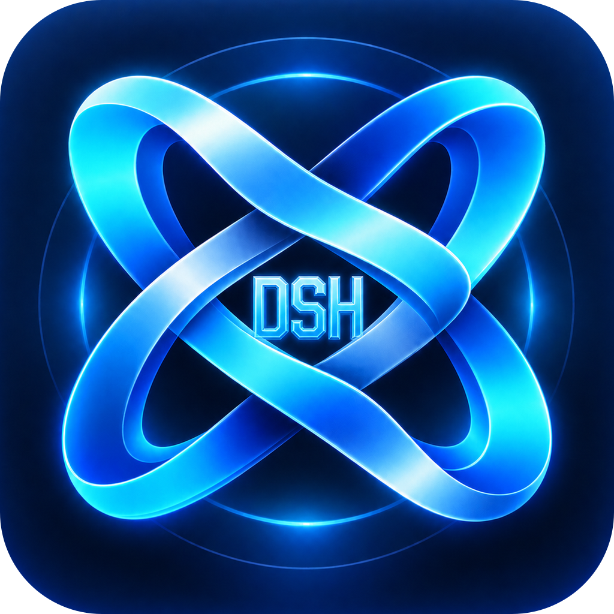

<p align="center">
  
</p>

<h1 align="center">DeepSeek Harness Desktop</h1>

<p align="center">让普通用户无需安装 Node.js 或使用命令行，即可在 macOS 和 Windows 上运行 DeepSeek Harness。</p>

<p align="center">
  <a href="README.md">简体中文</a> · <a href="README.en.md">English</a>
</p>

<p align="center">
  <a href="https://github.com/xiaoweidotnet/dsh-desktop/actions/workflows/ci.yml"></a>
  <a href="LICENSE"></a>
</p>

## 项目简介

DeepSeek Harness Desktop 是一个开源、跨平台的 Electron 桌面启动器。它不复制或修改 Harness 的主界面和调用协议，而是在 Electron 内置的私有 Node.js 运行时中启动官方 npm 包提供的真实 `dsh web`，再把本地 Web UI 显示在桌面窗口中。

DeepSeek 官方的 `npx` 启动方式与本项目使用的是同一个 npm 发布物：`@deepseek-ai/dsh`。本项目将精确版本的运行时直接打进桌面包，因此最终用户不需要安装 Node.js、pnpm，也不需要执行命令。

> 本项目是社区维护的非官方桌面封装，不隶属于 DeepSeek，也不代表 DeepSeek 官方背书。DeepSeek Harness 的名称、代码和相关权利归其各自权利人所有。

## 主要特性

- 双击即用，无需 Node.js、pnpm、终端或 PATH 配置。
- 支持 macOS ARM64/x64 和 Windows x64/ARM64。
- 保持官方 `dsh web` 调用形态和原生 Harness Web UI。
- 自动选择本地空闲端口，只监听 `127.0.0.1`。
- 会话、设置、凭证和附件保存在系统用户数据目录。
- 可视化选择工作区，Windows 使用 Harness 官方应用内目录浏览后端。
- macOS 正式签名包支持 GitHub Release 更新；Windows 提供便携 ZIP。
- 自动检测 npm Registry 上新发布的 Harness 运行时，不下载源码仓库。

## 下载与使用

正式版本发布后，请从 [GitHub Releases](https://github.com/xiaoweidotnet/dsh-desktop/releases) 下载与你电脑架构匹配的文件：

- Apple Silicon Mac：`mac-arm64.dmg`
- Intel Mac：`mac-x64.dmg`
- 大多数 Windows 电脑：`win-x64-portable.zip`
- Windows ARM 电脑：`win-arm64-portable.zip`

Windows 版解压 ZIP 后双击其中的 `DeepSeek Harness.exe`。首次打开后，在 Harness 设置界面配置 DeepSeek API Key 和模型即可使用。

## 开发运行

以下环境只供项目开发；最终用户不需要安装这些工具。

```sh
pnpm install
pnpm verify
pnpm test
pnpm dev
```

桌面壳会把 Harness 数据映射到 Electron 的用户数据目录，默认工作区位于 Documents 下的 `DeepSeek Harness Workspace`。

## 构建

```sh
pnpm dist:dir
pnpm smoke:packaged -- dist/mac-arm64
pnpm verify:bundle
pnpm dist:mac
pnpm dist:mac:x64
pnpm dist:win
pnpm dist:win:arm64
```

Windows 只生成可直接解压运行的 ZIP，不生成安装器 EXE。macOS 正式分发需要 Developer ID 签名和公证；Windows 正式分发需要代码签名证书。

## Harness 运行时更新

项目只把 npm Registry 已发布的版本视为可打包运行时，不下载或保留 DeepSeek Harness 源码 checkout：

```sh
pnpm check:harness
pnpm sync:harness
pnpm verify && pnpm test && pnpm dist:dir
```

[harness-runtime-sync.yml](.github/workflows/harness-runtime-sync.yml) 每周检查 npm 新版本并创建更新 PR；[release.yml](.github/workflows/release.yml) 根据版本 tag 构建并发布桌面包。用户电脑不会执行 Git、pnpm 或源码更新。

## 安全与隐私

- Harness 服务仅监听本机回环地址。
- Electron 启用 context isolation 并关闭 renderer Node integration。
- API Key、会话和工作区内容只属于用户本机数据，不应提交到仓库。
- 日志可能包含本地诊断信息，请按私密文件处理。

安全问题请参阅 [SECURITY.md](SECURITY.md)，贡献方式请参阅 [CONTRIBUTING.md](CONTRIBUTING.md)。架构约束见 [AGENTS.md](AGENTS.md)，目标与验收条件见 [goal.md](goal.md)，正式发布流程见 [RELEASE.md](RELEASE.md)。

## 许可证与致谢

本项目采用 [MIT License](LICENSE)。感谢 [DeepSeek Harness](https://github.com/deepseek-ai/deepseek-harness) 项目；桌面包使用其官方发布的 MIT npm 运行时。
